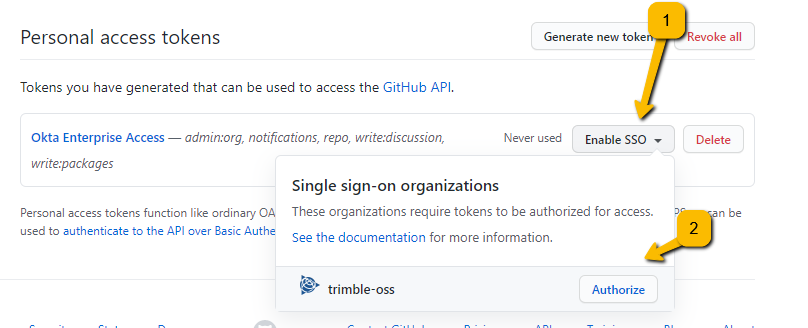

## Contributor Guidelines

Make sure you have first read and followed the instructions in the [README](../README.md).

### Contributor GitHub Access Configuration

- Create a GitHub Personal Access Token (PAT): [Creating a Personal Access Token](https://docs.github.com/en/github/authenticating-to-github/creating-a-personal-access-token)
  - The PAT you create only needs `repo` access. Ignore the other access permissions.
  - Make sure you give access to the `trimble-oss` organization for this PAT
    - 
    - See [About authentication with SAML single sign-on](https://docs.github.com/en/github/authenticating-to-github/about-authentication-with-saml-single-sign-on)

      ```text
      To use the API or Git on the command line to access protected content in an
      organization that uses SAML SSO, you will need to use an authorized personal
      access token over HTTPS
      ```

### Contributor Setup

#### Create a folder for all of your Trimble related work

- If it doesn't exist already, create a directory under your user directory (`~/`) for your Trimble related work called `~/work/trimble`.
- You will clone all of your Trimble related repositories in the `~/work/trimble` folder.
- Create a `.gitconfig` file in the `~/work/trimble` folder that specifies your name and company email. For example:

```ini
[user]
    email = my_name@trimble.com
    name = Your Full Name
```

#### Edit your global user `.gitconfig`

- In your top level user folder, `~/` you should have a `.gitconfig` file.
- Edit your global user `~/.gitconfig` to include the following sections:

```ini
[includeIf "gitdir:~/work/trimble/**"]
    path = ~/work/trimble/.gitconfig

[pull]
    ff = only

[filter "lfs"]
    clean = git-lfs clean -- %f
    smudge = git-lfs smudge -- %f
    process = git-lfs filter-process
    required = true
```

Recommended: VS Code is a wonderful editor for git commits, merges and diffs. If you use VS Code it is recommended to add these additional sections to your global user `~/.gitconfig`

```ini
[core]
    editor = code --wait
    autocrlf = input

[merge]
    tool = code

[mergetool "code"]
    cmd = code --wait $MERGED

[diff]
    tool = code

[difftool "code"]
    cmd = code --wait --diff $LOCAL $REMOTE
```

### How to Fork

- **Glossary**
  - `Fork` - your personal repository that begins as an exact copy of the primary project repository (*trimble-oss/{repository-name}*) at the time the [fork](https://guides.github.com/activities/forking/) is created
  - `Remote` - Git works by keeping copies of source code on your local machine, while also maintaining copies in other places, called `remotes`. Some teams work with a single `remote` which is nearly always called `origin` by convention. However, in a fork based flow, local copies of repositories typically have two `remotes` - `origin` which refers to the individual user's fork (*username/{repository-name}*), and `upstream` which refers to the primary project repository (*trimble-oss/{repository-name}*).
  - `origin` - in a [fork](https://guides.github.com/activities/forking/) based workflow, `origin` represents a remote referring to the user's fork of the primary project repository.
  - `upstream` - in a [fork](https://guides.github.com/activities/forking/) based workflow, `upstream` represents a remote referring to the primary project repository.

#### Create a Fork

Create a Fork of the [primary repository (https://github.com/trimble-oss/{repository-name})](https://github.com/trimble-oss/{repository-name}) you will be contributing to. Click on the `Fork` button on the top right of that page in your browser when on the GitHub website.

#### Clone your Fork Locally

From a command line, clone your forked repository to your `~/work/trimble` folder. For example, <https://github.com/github-user-name/{repository-name}>.

**Note - *do not* clone the primary repository. Clone your fork.**

```bash
> cd ~/work/trimble

> git clone https://github.com/github-user-name/{repository-name}
Cloning into '{repository-name}'...
remote: Enumerating objects: 126, done.
remote: Counting objects: 100% (126/126), done.
remote: Compressing objects: 100% (89/89), done.
remote: Total 126 (delta 53), reused 100 (delta 30), pack-reused 0
Receiving objects: 100% (126/126), 5.42 MiB | 15.38 MiB/s, done.
Resolving deltas: 100% (53/53), done.

> cd {repository-name}

> git remote -v
origin	https://github.com/github-user-name/{repository-name} (fetch)
origin	https://github.com/github-user-name/{repository-name} (push)

```

Note at this point that `origin` represents your fork. Next we'll add the primary repository as a remote called `upstream`.

#### Connect `upstream` to the Primary Repository

Add the primary repository as a remote named `upstream` and be sure to [use HTTPS (not SSH)](#git-remote-configuration---https-vs-ssh). Your output should look like the following (except the `origin` remote should refer to the fork for your GitHub user name.

```bash
> git remote add upstream https://github.com/trimble-oss/{repository-name}
> git remote -v
origin	https://github.com/github-user-name/{repository-name} (fetch)
origin	https://github.com/github-user-name/{repository-name} (push)
upstream	https://github.com/trimble-oss/{repository-name} (fetch)
upstream	https://github.com/trimble-oss/{repository-name} (push)
```

### Working with Forks

#### Synchronizing `main`

Contributors will perform all of their work, create commits, and manage branches in their own [forks](https://guides.github.com/activities/forking/). Once a contributor has verified their work meets all contribution standards for a given project, they may submit a Pull Request (PR) to a branch in the primary repository (typically targeting `main` but possibly a different branch in some special cases).

A common command flow when working with forks looks like this:

```bash
> git fetch upstream
...
> git checkout main
...
> git pull upstream main
...
> git push origin main
...
```

The `git fetch upstream` command brings any changes from a remote (`upstream` in this case) to the local machine. You can fetch any time you want and it will not impact what you are currently working on.

Running `git checkout main` will checkout your local `main` branch. It's typicaly good practice to make sure you do not have any uncommitted changes before checking out `main` (or any other branch, for that matter).

The `git pull upstream main` command will take any fetched changes from `upstream/main` and apply them to your local `main` branch.

Finally, running `git push origin main` will ensure that your `origin/main` fork has the latest changes from the primary repository applied to its `main` branch.

#### Rebasing

Merge commits are generally not allowed in the `main` branch in the primary repository. This requires contributors to rebase their branches to ensure a clean, concise and consistent commit history.

Explaining rebasing is beyond the scope of this document. However the following resources explain how rebasing works and how to rebase your own branches:

- [Don't Fear the Rebase](https://medium.com/hackernoon/dont-fear-the-rebase-bca683888dae)
- [About Git Rebase](https://docs.github.com/en/github/getting-started-with-github/about-git-rebase)

#### Git Remote configuration - HTTPS vs SSH

- Note on setup of git CLI for access to repositories in organizations configured with [Single sign-on (SSO)](https://en.wikipedia.org/wiki/Single_sign-on):
  - Remotes must use HTTPs and not SSH, otherwise you will have authentication issues cloning and fetching.
  - This can be checked post setup with: <code>git remote -v</code>.
  - Otherwise it can also be set post setup with: <code>git remote set-url *\<remote name\>* *\<url of your fork\>*</code>.
    - See [How to Fork](#how-to-fork) for more information on remotes

### Additional notes

- As a rule of thumb, never work on main. Always create a branch.
